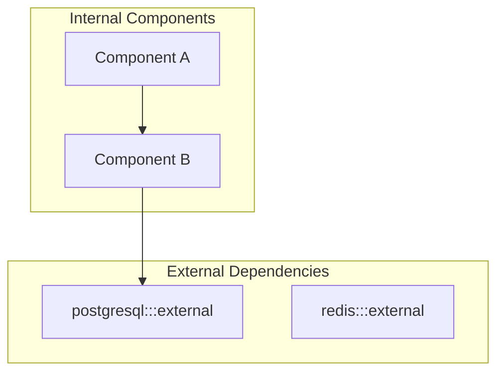
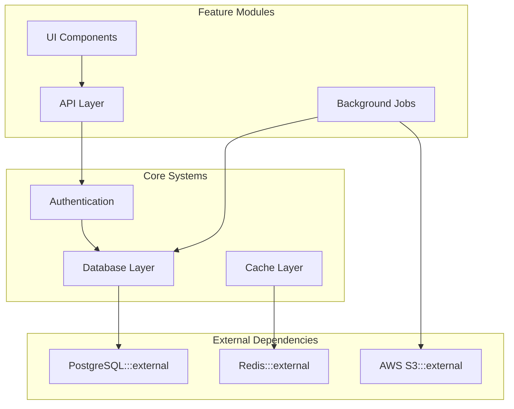
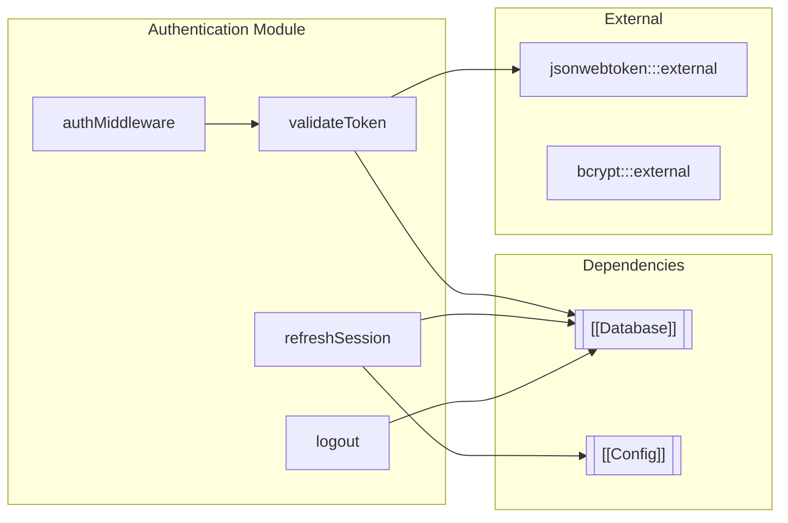
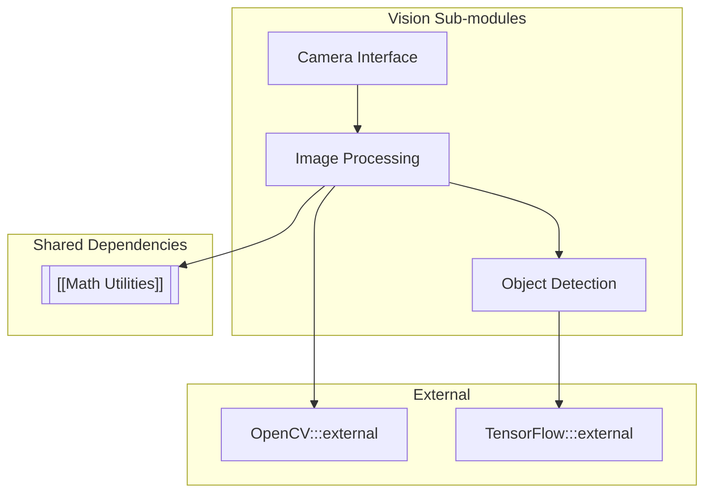
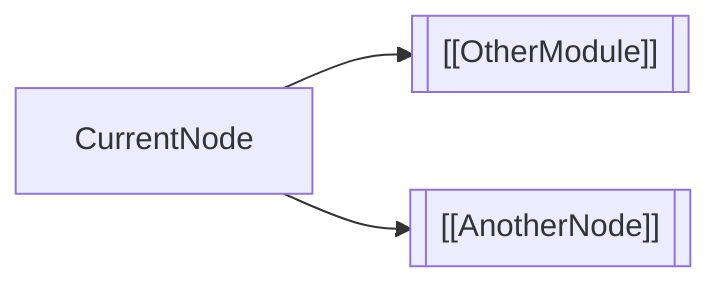

# Mermaid Patterns

All non-atomic levels MUST include a mermaid graph. External dependencies MUST be visually distinguished.

## Table of Contents

- [Standard: External Dependency Marking](#standard-external-dependency-marking)
- [HOME Level (Codebase Overview)](#home-level-codebase-overview)
- [Module Level (Internal Structure)](#module-level-internal-structure)
- [Deep Nesting (Sub-modules)](#deep-nesting-sub-modules)
- [Cross-Module References](#cross-module-references)
- [Direction Guidelines](#direction-guidelines)
- [Subgraph Naming Conventions](#subgraph-naming-conventions)
- [Node Shape Conventions](#node-shape-conventions)
- [Color-Blind Friendly Styling](#color-blind-friendly-styling)

---

## Standard: External Dependency Marking

Always use CSS class + subgraph combination for maximum visibility:



**Required elements:**

1. `subgraph External` - Groups all third-party dependencies
2. `:::external` class - Applies visual styling
3. `classDef external` - Defines dashed border + gray fill

---

## HOME Level (Codebase Overview)

Shows high-level module relationships and major external dependencies.

**Direction:** `TB` (top-to-bottom) - Shows hierarchy, fits wide screens



---

## Module Level (Internal Structure)

Shows nodes within module + dependencies on other modules and externals.

**Direction:** `LR` (left-to-right) - Shows data flow, fits narrow panels



---

## Deep Nesting (Sub-modules)

For deeply nested hierarchies, maintain consistency with HOME level.

**Direction:** `TB` (top-to-bottom) - Consistency with codebase level



---

## Cross-Module References

Use double-bracket notation as visual hint (not clickable in Obsidian):



This renders the wikilink syntax visually, reminding readers these notes exist.

---

## Direction Guidelines

| Level | Direction | Rationale |
|-------|-----------|-----------|
| HOME (codebase) | `TB` | Hierarchical view, wide screen friendly |
| Module | `LR` | Data flow emphasis, sidebar friendly |
| Sub-module | `TB` | Consistency with HOME |

---

## Subgraph Naming Conventions

| Purpose | Naming Pattern |
|---------|---------------|
| Internal components | `subgraph ModuleName["Display Name"]` |
| Dependencies on other modules | `subgraph Deps["Dependencies"]` |
| External packages | `subgraph External["External Dependencies"]` |

---

## Node Shape Conventions

| Type | Shape | Example |
|------|-------|---------|
| Internal node | Rectangle | `A[nodeName]` |
| Module reference | Double brackets | `A[["[[ModuleName]]"]]` |
| External package | Rectangle + class | `A[package:::external]` |
| Decision point | Diamond | `A{condition}` |
| Database | Cylinder | `A[(database)]` |

---

## Color-Blind Friendly Styling

The default external styling uses pattern (dashed line) + shade (gray fill) for accessibility:

```
classDef external fill:#e1e1e1,stroke:#666,stroke-dasharray: 5 5
```

Do not rely on color alone to distinguish external dependencies.
