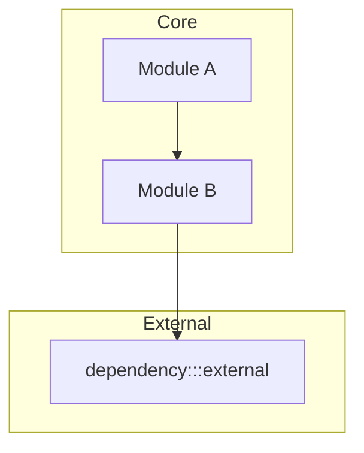
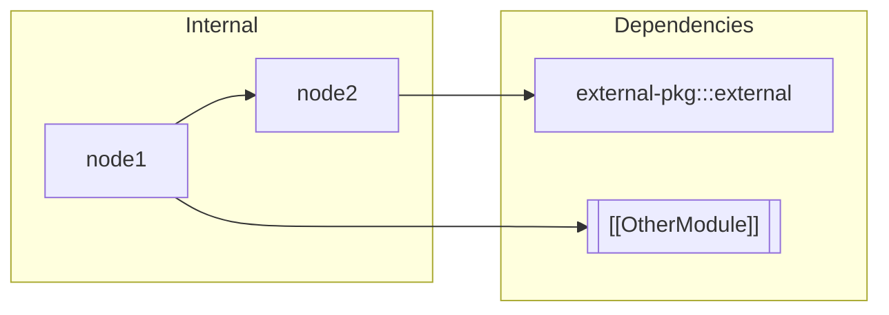

# Templates

All frontmatter schemas are **customizable defaults**. Users can add properties during the planning phase.

## Table of Contents

- [HOME.md](#homemd)
- [Module Narrative](#module-narrative-modulemd)
- [Node: Code-Bound](#node-code-bound)
- [Node: Code-Spanning](#node-code-spanning)
- [Node: Conceptual](#node-conceptual)
- [Node: External](#node-external)
- [.wiki-progress.md](#wiki-progressmd)
- [Stub Template](#stub-template)

---

## HOME.md

**Minimum required frontmatter:**

```yaml
---
type: home
codebase_name: 
codebase_path: 
wiki_path: 
stack: []
atomic_granularity: function | component | class | file | custom
include_code_default: true
test_coverage: none | per-module | per-node
---
```

**Template:**

````markdown
# [Codebase Name]

## Overview

[Index paragraph with [[Module]] links describing the codebase architecture
and how modules relate. This paragraph should allow a reader to understand
the system's purpose and navigate to any major component.]

## Architecture



## Modules

- [[ModuleA/ModuleA|Module A]] - Brief description
- [[ModuleB/ModuleB|Module B]] - Brief description
````

---

## Module Narrative (<Module>.md)

**Minimum required frontmatter:**

```yaml
---
type: module
parent: "[[HOME]]" | "[[ParentModule]]"
status: pending | in-progress | complete
---
```

**Optional fields:** `node_count`, `nodes_documented`, `created`, `updated`, `tags`, `owner`

**Template:**

````markdown
# [Module Name]

## Overview

[Index paragraph with [[node]] links. Describe what this module does,
its responsibilities, and how its components work together. Every node
in this module should be linked naturally in this narrative.]

## Architecture



## Nodes

- [[node1]] - Brief description
- [[node2]] - Brief description
````

---

## Node: Code-Bound

**Minimum required frontmatter:**

```yaml
---
type: node
node_kind: code-bound
parent: "[[ModuleName]]"
source:
  - path: relative/path/to/file.ts
    function: functionName  # Or class: ClassName
language: typescript
status: complete | stub | needs-review
---
```

**Optional fields:** `include_code`, `created`, `tags`, `tested_by`, `complexity`

**Template:**

````markdown
# [Node Name]

## Purpose

[One paragraph explaining what this code does and why it exists.]

## Code

```typescript
// Only if include_code: true (inherits from global default)
// Relevant code snippet - function/class level, NOT arbitrary lines
```

## Dependencies

- [[OtherNode]] - Why it depends on this
- `external-package` - What it's used for

## Used By

- [[CallingNode]] - How it's used

## Tests

<!-- Only if test_coverage enabled -->

| Test | Description | Status |
|------|-------------|--------|
| `test_name` | What it verifies | ✅ |
````

---

## Node: Code-Spanning

**Minimum required frontmatter:**

```yaml
---
type: node
node_kind: code-spanning
parent: "[[ModuleName]]"
source:
  - path: src/utils/math.ts
  - path: src/physics/vector.ts
status: complete | stub | needs-review
---
```

**Template:**

```markdown
# [Concept Name]

## Purpose

[Explain the cross-cutting concept and why it spans multiple files.]

## Implementation Locations

| File | Responsibility |
|------|---------------|
| `src/utils/math.ts` | Core vector operations |
| `src/physics/vector.ts` | Physics-specific extensions |

## Dependencies

- [[OtherConcept]]

## Used By

- [[ConsumingModule]]
```

---

## Node: Conceptual

**Minimum required frontmatter:**

```yaml
---
type: node
node_kind: conceptual
parent: "[[ModuleName]]"
domain: mathematics | architecture | algorithm | convention | other
status: complete | stub | needs-review
---
```

**Optional fields:** `related_code` (glob patterns for soft references)

**Template:**

```markdown
# [Concept Name]

## Overview

[Explain the concept, its mathematical/theoretical foundation, 
and its role in the codebase.]

## Application

[How this concept is applied in the codebase, with links to 
nodes that implement it.]

## Related Nodes

- [[ImplementingNode1]]
- [[ImplementingNode2]]

## External Resources

- [Reference Link](url) - Description
```

---

## Node: External

**Minimum required frontmatter:**

```yaml
---
type: node
node_kind: external
parent: "[[ModuleName]]"
source:
  - package: package-name
    version: 1.0.0
status: complete | stub
---
```

**Template:**

```markdown
# [Package Name]

## Purpose

[Why this dependency is used in the codebase.]

## Usage Patterns

[How it's typically used, with examples if helpful.]

## Key APIs Used

- `function1()` - Used for X
- `Class.method()` - Used for Y

## Consuming Nodes

- [[Node1]] - How it uses this package
- [[Node2]] - How it uses this package

## Documentation

- [Official Docs](url)
```

---

## .wiki-progress.md

**Required frontmatter:**

```yaml
---
codebase: 
codebase_path: 
wiki_path: 
created: YYYY-MM-DD
last_session: YYYY-MM-DD
status: planning | in-progress | complete | debugging
atomic_granularity: 
include_code_default: true
test_coverage: none | per-module | per-node
custom_frontmatter: []  # User-defined additional fields
---
```

**Template:**

```markdown
# Wiki Progress Tracker

> [!warning] Internal File
> This file tracks wiki generation progress. Do not edit manually.
> Delete this file when wiki is complete and verified.

## Module Status

| Module | Narrative | Nodes | Complete | Status |
|--------|-----------|-------|----------|--------|
| Auth | ✅ | 8 | 8 | ✅ complete |
| API | ✅ | 12 | 5 | 🔄 in-progress |
| Utils | ❌ | 6 | 0 | ⏳ pending |

## Current Queue

- [ ] `API/validateRequest`
- [ ] `API/errorHandler`
- [ ] `API/middleware`
- [ ] `API/rateLimit`
- [ ] `API/logging`

## Debug Queue

<!-- Only populated when status: debugging -->

## Session Log

### YYYY-MM-DD
- **Action:** [what was done]
- **Completed:** [list]
- **Notes:** [user decisions, adjustments]
```

---

## Stub Template

When creating placeholder notes for large codebases:

```yaml
---
type: node
node_kind: [appropriate type]
parent: "[[ModuleName]]"
status: stub
---
```

```markdown
# [Node Name]

> [!warning] Stub
> This note has not been completed. Continue wiki generation to fill in details.

## Purpose

[To be documented]
```
